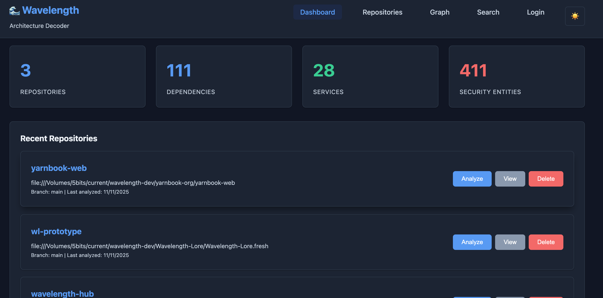
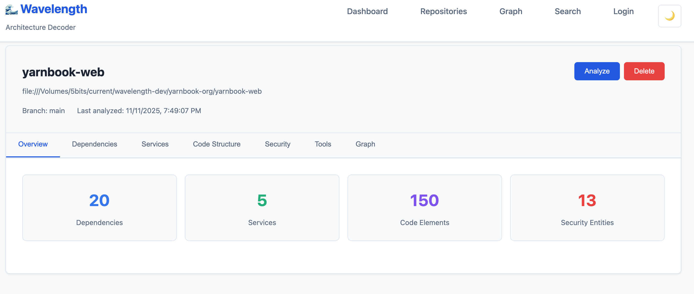
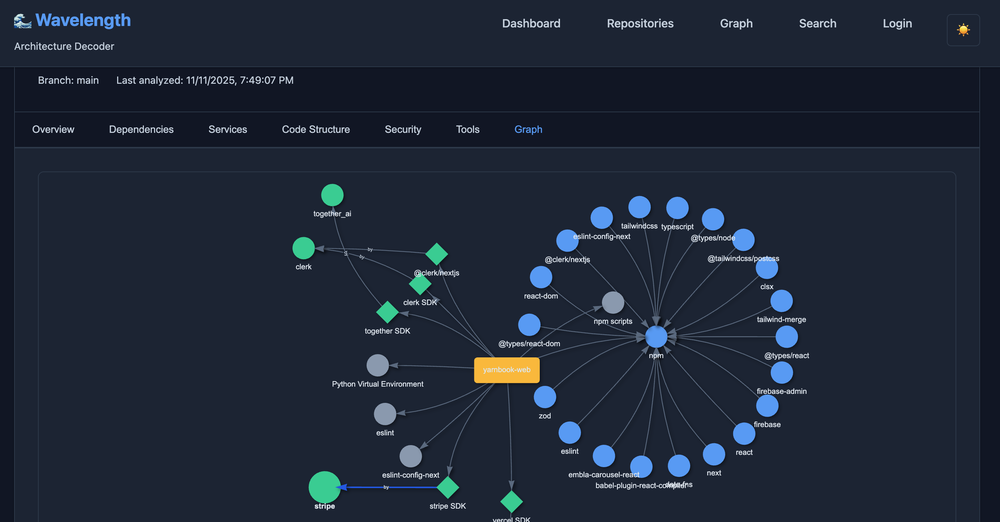
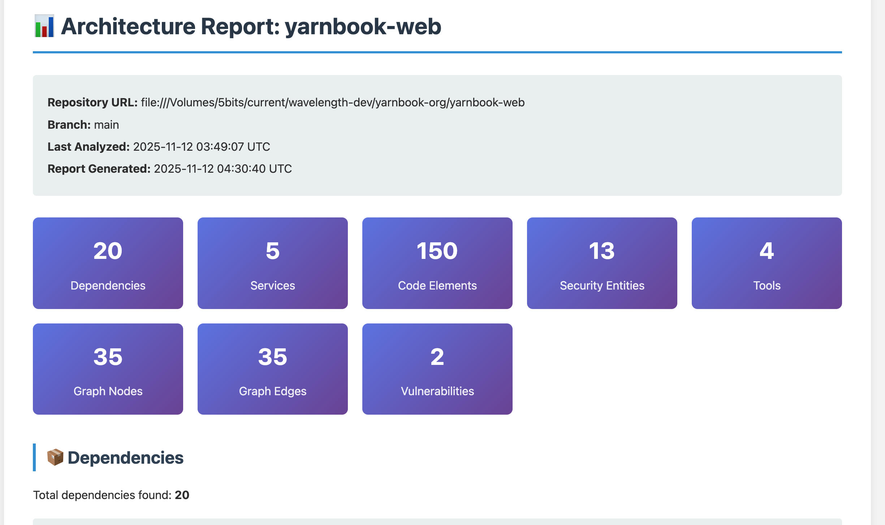

# Wavelength Architecture Decoder

<div align="center">

**🔍 Understand Your Codebase Architecture Through Intelligent Analysis**

A self-contained, powerful tool that automatically discovers and visualizes the complete architecture of your repositories—from dependencies and services to security configurations and code relationships.

[](VERSION)
[](https://www.rust-lang.org/)
[](LICENSE)

</div>

---

## 🎯 What Is This?

**Wavelength Architecture Decoder** is a comprehensive analysis tool that automatically builds a knowledge graph of your repository's architecture. It discovers:

- **What external services** your code uses (AWS, Vercel, Clerk, Firebase, AI services, etc.)
- **What dependencies** you have and how they relate
- **What security configurations** exist (IAM roles, Lambda functions, S3 buckets, API keys)
- **How your code is structured** (functions, classes, modules, and their relationships)
- **What tools and scripts** are configured (build tools, test frameworks, linters)
- **What tests exist** and which frameworks are used (Jest, Mocha, Pytest, JUnit, XCTest, etc.)
- **What documentation** is available (README files, API docs, guides)
- **How everything connects** through an interactive knowledge graph

Perfect for **onboarding new developers**, **understanding legacy codebases**, **security audits**, and **AI assistant integration**.

---

## ✨ Key Features

### 🔗 **Intelligent Relationship Discovery**
- **Automatic Code-to-Service Mapping**: Discovers which functions use which services (e.g., `getAdminStorage` → Firebase SDK)
- **Code-to-Dependency Relationships**: Maps which code elements import or use specific dependencies
- **Confidence Scoring**: Each relationship includes confidence scores and evidence
- **No Hard-Coding Required**: Uses pattern matching, word boundaries, and code analysis

### 📦 **Comprehensive Dependency Analysis**
- **Multi-Package Manager Support**: npm, pip, Cargo, Maven, Gradle, Go modules, Swift Package Manager, CocoaPods
- **Dependency Graph Construction**: Visualizes dependency trees and relationships
- **Version Conflict Detection**: Identifies potential version conflicts
- **Transitive Dependency Resolution**: Maps indirect dependencies
- **Search & Filter**: Powerful filtering by package manager, type, and name
- **Xcode Project Support**: Parses `.xcodeproj/project.pbxproj` files for Swift Package Manager dependencies

### 🔌 **Service Detection**
- **Cloud Providers**: AWS (S3, Lambda, DynamoDB, etc.), Vercel, Netlify
- **Authentication Services**: Clerk, Auth0, Firebase Auth
- **AI Services**: OpenAI, Anthropic, GitHub Copilot, Together AI, Mistral AI
- **Databases**: PostgreSQL, MongoDB, Redis, Firebase Firestore
- **APIs & SDKs**: Stripe, Twilio, SendGrid, and 50+ more services
- **Configurable Patterns**: Extend detection via JSON configuration files
- **Plugin System**: Add custom service detection rules
- **Comment Filtering**: Ignores service mentions in comments to reduce false positives

### 🛠️ **Tool Discovery**
- **Build Tools**: Webpack, Vite, Rollup, esbuild
- **Test Frameworks**: Jest, Mocha, pytest, cargo test
- **Linters & Formatters**: ESLint, Prettier, rustfmt, black
- **Deployment Tools**: Docker, Kubernetes, GitHub Actions, GitLab CI
- **Custom Scripts**: Detects npm scripts, shell scripts, and executables
- **Tool Relationships**: Maps tools to dependencies and services they use

### 🧪 **Test Detection**
- **Multi-Framework Support**: Detects tests across multiple frameworks
  - **JavaScript/TypeScript**: Jest, Mocha, Vitest
  - **Python**: Pytest, unittest
  - **Rust**: Cargo test
  - **Go**: Go test
  - **Java**: JUnit, TestNG
  - **Swift/Objective-C**: XCTest, Quick
- **Test File Detection**: Automatically identifies test files by naming patterns and directory structure
- **Test Function Extraction**: Extracts test functions with signatures, parameters, and assertions
- **Test Metadata**: Captures test framework, type (unit/integration/E2E), suite names, setup/teardown methods
- **Graph Integration**: Test nodes appear in knowledge graph with relationships to frameworks and code being tested
- **Filtering & Search**: Filter tests by framework, language, or search by name

### 📚 **Documentation Indexing**
- **File Type Detection**: Automatically indexes markdown, text, reStructuredText, AsciiDoc, and wiki files
- **Metadata Extraction**: Extracts titles, descriptions, word counts, and line counts
- **Content Analysis**: Detects code examples, API references, and diagrams in documentation
- **Preview Generation**: Shows content previews for quick scanning
- **Deduplication**: Automatically removes duplicate documentation entries
- **Repository Filtering**: Ensures documentation is properly scoped to each repository
- **Search & Filter**: Search documentation by title, description, or content; filter by type

### 🔗 **File Linking & Editor Integration**
- **Open in Editor**: Click any file path to open it directly in your preferred editor
  - **VS Code**: Default editor protocol (`vscode://file/...`)
  - **Configurable**: Set custom editor via `EDITOR_PROTOCOL` environment variable
  - **Supported Editors**: VS Code, Cursor, Sublime Text, Atom, and more
- **Show in Finder**: Copy file paths to clipboard for easy navigation
  - **macOS**: Copy path for Finder (Cmd+Shift+G)
  - **Windows**: Copy path for File Explorer address bar
- **Available Everywhere**: File links appear on:
  - Code elements (functions, classes, modules)
  - Dependencies (manifest file locations)
  - Services (detection locations)
  - Security entities (configuration files)
  - Tools (configuration files)
  - Tests (test file locations)
  - Documentation (documentation file paths)

### 🔒 **Security Analysis**
- **Infrastructure as Code**: Analyzes Terraform, CloudFormation, Serverless Framework, AWS SAM
- **IAM Roles & Policies**: Extracts AWS IAM configurations and permissions
- **Lambda Functions**: Identifies serverless functions and their configurations
- **S3 Buckets**: Detects bucket configurations and access policies
- **API Key Detection**: Finds hardcoded API keys and environment variable references
- **Security Vulnerabilities**: Identifies wildcard permissions, public access, missing encryption
- **Firebase Rules**: Analyzes Firebase security rules
- **Environment Templates**: Detects `.env.example` and security configuration files

### 📝 **Code Structure Analysis**
- **Multi-Language Support**: JavaScript/TypeScript, Python, Rust, Go, Swift, Objective-C, Java
- **Function & Class Extraction**: Identifies functions, classes, modules, interfaces
- **Call Graph Construction**: Maps function calls and relationships
- **Import/Export Tracking**: Tracks module dependencies
- **Filtering**: Automatically excludes compiled classes and minified code
- **Search & Navigation**: Powerful search, filtering, and grouping capabilities

### 🕸️ **Interactive Knowledge Graph**
- **Visual Exploration**: Interactive graph visualization using vis.js
- **Node Types**: Repositories, Dependencies, Services, Code Elements, Security Entities, Tools, Tests, Test Frameworks
- **Relationship Types**: Uses, Depends On, Calls, Configures, Secures, Tests, and more
- **Smart Navigation**: Click nodes to see details, navigate to related entities
- **Toggle Controls**: Show/hide specific node types (tests and code elements off by default for cleaner views)
- **Dark/Light Theme**: Beautiful visualization in both themes
- **Entity Color Coding**: Visual distinction between entity types
- **Legend**: Interactive legend with checkboxes to filter node types

### 🎨 **Modern Web UI**
- **Dashboard**: Overview of all repositories and statistics
- **Repository Detail View**: Comprehensive tabs for each analysis aspect
- **Real-Time Progress**: Live progress tracking with server polling (⚠️ **Note**: For reliable progress updates during long analyses, check server logs—see Quick Start section)
- **Entity Detail Modals**: Deep dive into any entity with relationships
- **Search & Filter**: Advanced filtering across all entity types
- **Responsive Design**: Works on desktop and mobile devices
- **Browser History Navigation**: Full back/forward button support with URL state management
- **Source Code Links**: Click any file path to open in your editor or copy to Finder/Explorer
- **Configurable Editor**: Set your preferred editor (VS Code, Cursor, Sublime, etc.) via `EDITOR_PROTOCOL` environment variable
- **Tests Tab**: Browse and filter detected tests by framework and language
- **Documentation Tab**: Browse indexed documentation files with previews

### 🔧 **Developer-Friendly**
- **Self-Contained**: No external services required—runs entirely locally
- **Embedded Database**: SQLite for zero-configuration setup
- **Local Repository Support**: Analyze local file paths directly
- **Private Repository Support**: SSH keys, tokens, and username/password auth
- **REST & GraphQL APIs**: Choose your preferred API style
- **Progress Tracking**: Real-time analysis progress with detailed step information
- **Update Notifications**: Optional automatic version checking with GitHub releases (can be disabled)

### 📄 **Report Generation**
- **HTML Reports**: Generate comprehensive, shareable HTML reports for any repository
- **Complete Overview**: Includes all dependencies, services, code structure, security findings, and tools
- **Statistics Dashboard**: Visual statistics cards showing key metrics
- **Grouped Data**: Dependencies grouped by package manager, services by provider
- **Security Highlights**: Prominent display of vulnerabilities and security issues
- **Knowledge Graph Summary**: Graph statistics and node type breakdowns
- **Print-Friendly**: Clean, professional formatting suitable for documentation

### 🤖 **AI Assistant Integration**
- **Natural Language Queries**: Ask questions about your codebase in plain English
- **Interactive Chat UI**: Beautiful dark-themed chat interface for easy interaction
- **Intelligent Responses**: AI-powered answers using OpenAI GPT-4 with full context
- **Function Discovery**: "What functions are available?" - Discover available functions and their usage
- **Service Analysis**: "What services are used?" - Get comprehensive service listings
- **Dependency Insights**: "What dependencies does this use?" - Understand your dependency graph
- **Test Discovery**: "What tests are available?" - Find test files and test functions
- **Documentation Search**: "What documentation exists?" - Browse README files and API docs
- **Refactoring Impact**: "What would break if I rename X?" - Analyze refactoring risks
- **Rich Results Display**: Shows sources, graph statistics, and related entities
- **Repository Selection**: Easy dropdown to switch between repositories
- **Knowledge Graph Integration**: Leverages the full knowledge graph for context-aware responses
- **Standalone Service**: Runs on port 8000, isolated in `ai-assistant/` folder
- **No Hard-Coding**: Automatically discovers relationships from your codebase analysis

---

## 🚀 Quick Start

### Prerequisites
- **Rust 1.70+** ([Install Rust](https://www.rust-lang.org/tools/install))
- **Git** (for repository cloning)
- **4GB+ RAM** recommended

### Installation

```bash
# Clone the repository
git clone https://github.com/mimelator/wavelength-arch-decoder.git
cd wavelength-arch-decoder

# Build the project
cargo build --release

# Run the server
cargo run --release
```

The server will start on `http://localhost:8080` by default.

### First Analysis

1. **Open the Web UI**: Navigate to `http://localhost:8080`
2. **Add a Repository**: Click "Add Repository" and provide:
   - Repository name
   - URL (GitHub, GitLab, or local file path)
   - Branch (defaults to `main`)
3. **Analyze**: Click "Analyze" and watch real-time progress

> **⚠️ Important: Monitoring Analysis Progress**
> 
> Analysis can take several minutes for large repositories. While the UI attempts to show progress, **the most reliable way to monitor progress is to watch the server logs** in your terminal. The server provides detailed, real-time diagnostic messages including:
> - Step-by-step progress (e.g., "Step 4/10: Extracting dependencies...")
> - Detailed counts (e.g., "✓ Detected 7 service(s): AWS S3 (aws), Clerk (clerk)...")
> - Storage progress with percentages (e.g., "Stored 5000/55000 elements (9%)...")
> - Language breakdowns and entity type summaries
> 
> **Example log output:**
> ```
> Step 4/10: Extracting dependencies from repository...
> ✓ Found 3 manifest files with 127 total dependencies
> Storing 127 dependencies from 3 manifest file(s) in database...
>   Processing manifest 1/3: package.json (45 dependencies)
>   Processing manifest 2/3: requirements.txt (82 dependencies)
> ✓ Successfully stored 127 dependencies from 3 manifest file(s)
> ```
> 
> Keep your terminal visible during analysis to see exactly what's happening at each stage.

### 🤖 Using the AI Assistant

The AI Assistant provides an interactive chat interface for querying your codebase architecture:

1. **Start the AI Assistant**:
   ```bash
   cd ai-assistant
   ./start.sh
   ```

2. **Open the Chat UI**: Navigate to `http://localhost:8000`

3. **Select a Repository**: Choose from the dropdown menu

4. **Ask Questions**: Try queries like:
   - "What functions are available?"
   - "What services are used?"
   - "What dependencies does this use?"
   - "What tests are available?"
   - "What documentation exists?"
   - "What functions use Firebase?"
   - "What would break if I rename getAdminStorage?"

**Requirements**: 
- Architecture Decoder must be running on `http://localhost:8080`
- OpenAI API key (optional - works without it but with less detailed responses)
- See [AI Assistant README](ai-assistant/README.md) for full setup instructions
4. **Explore**: Browse dependencies, services, code structure, security, and the knowledge graph
5. **Generate Report**: Click "Generate Report" to create a comprehensive HTML report

<div align="center">

### Dashboard View

*Dashboard showing all repositories and their analysis status*

### Repository Overview

*Repository detail page with comprehensive analysis overview*

### Knowledge Graph Visualization

*Interactive knowledge graph showing relationships between entities*

### Generated Report

*Comprehensive HTML report with architecture overview*

</div>

---

## 🌐 Language Support

### ✅ Fully Supported Languages

These languages have **complete code structure analysis** including function/class extraction, imports, and service detection:

| Language | Extensions | Code Parsing | Service Detection | Dependency Detection |
|----------|-----------|--------------|-------------------|---------------------|
| **JavaScript/TypeScript** | `.js`, `.jsx`, `.ts`, `.tsx` | ✅ Full | ✅ Yes | ✅ npm, yarn |
| **Python** | `.py` | ✅ Full | ✅ Yes | ✅ pip, poetry |
| **Rust** | `.rs` | ✅ Full | ✅ Yes | ✅ Cargo |
| **Go** | `.go` | ✅ Full | ✅ Yes | ✅ go.mod |
| **Swift** | `.swift` | ✅ Full | ✅ Yes | ✅ SPM, CocoaPods |
| **Objective-C** | `.m`, `.mm` | ✅ Full | ✅ Yes | ✅ CocoaPods |
| **Java** | `.java` | ✅ Full | ✅ Yes | ✅ Maven, Gradle |

### ⚠️ Partially Supported Languages

These languages have **dependency detection** but **no code structure parsing**:

| Language | Extensions | Code Parsing | Service Detection | Dependency Detection |
|----------|-----------|--------------|-------------------|---------------------|
| **C/C++** | `.c`, `.cpp`, `.h`, `.hpp` | ❌ No | ❌ No | ⚠️ Build systems only |
| **C#** | `.cs` | ❌ No | ❌ No | ⚠️ NuGet |
| **PHP** | `.php` | ❌ No | ❌ No | ⚠️ Composer |
| **Ruby** | `.rb` | ❌ No | ❌ No | ⚠️ Bundler/Gemfile |
| **Kotlin** | `.kt` | ❌ No | ❌ No | ⚠️ Gradle/Maven |

### 📋 Package Manager Support

| Package Manager | Supported | File(s) Detected |
|----------------|-----------|------------------|
| **npm/yarn** | ✅ Yes | `package.json` |
| **pip** | ✅ Yes | `requirements.txt`, `setup.py` |
| **Cargo** | ✅ Yes | `Cargo.toml` |
| **Maven** | ✅ Yes | `pom.xml` |
| **Gradle** | ✅ Yes | `build.gradle` |
| **Go Modules** | ✅ Yes | `go.mod` |
| **Swift Package Manager** | ✅ Yes | `Package.swift`, `project.pbxproj` |
| **CocoaPods** | ✅ Yes | `Podfile` |
| **Composer** | ✅ Yes | `composer.json` |
| **NuGet** | ✅ Yes | `.csproj`, `packages.config` |

---

## 📖 Use Cases

### 🎓 **Onboarding New Developers**
Quickly understand a codebase's architecture, dependencies, and service integrations without reading thousands of lines of code.

### 🔍 **Legacy Codebase Exploration**
Discover hidden dependencies, undocumented service integrations, and security configurations in older repositories.

### 🔒 **Security Audits**
Identify hardcoded API keys, analyze IAM policies, detect security vulnerabilities, and map security relationships.

### 🤖 **AI Assistant Integration**
Use the interactive AI Assistant chat interface (`http://localhost:8000`) to ask natural language questions about your codebase. Get AI-powered answers about functions, services, dependencies, and refactoring impact analysis. Perfect for quick codebase exploration and understanding.

### 📊 **Architecture Documentation**
Automatically generate up-to-date architecture documentation and dependency graphs.

### 🔄 **Migration Planning**
Understand service dependencies and relationships when planning migrations or refactoring.

### 🛡️ **Compliance & Governance**
Track which services and dependencies are used across multiple repositories for compliance reporting.

---

## 🏗️ Architecture

### Self-Contained Design

**No External Dependencies** - Everything runs locally:
- ✅ Embedded SQLite database
- ✅ Built-in repository crawler
- ✅ Local file processing
- ✅ No cloud services required
- ✅ No third-party APIs needed

### Core Components

```
┌─────────────────────────────────────────────────────────┐
│                    Web UI (React-like)                   │
│         Dashboard | Repository Browser | Graph           │
└───────────────────────┬─────────────────────────────────┘
                        │
┌───────────────────────▼─────────────────────────────────┐
│                    REST & GraphQL APIs                    │
│     /repositories | /graph | /code | /security | /tools   │
└───────────────────────┬─────────────────────────────────┘
                        │
        ┌───────────────┼───────────────┐
        │               │               │
┌───────▼──────┐ ┌─────▼──────┐ ┌─────▼──────┐
│  Ingestion    │ │  Analysis   │ │   Graph    │
│  Service      │ │  Engine     │ │  Builder   │
└───────┬───────┘ └─────┬───────┘ └─────┬──────┘
        │               │               │
        └───────────────┼───────────────┘
                        │
        ┌───────────────▼───────────────┐
        │      SQLite Database          │
        │  (Repositories | Dependencies │
        │   Services | Code | Security) │
        └──────────────────────────────┘
```

### Analysis Pipeline

1. **Repository Ingestion**: Clone or access repository (Git, local path)
2. **Dependency Extraction**: Parse package.json, requirements.txt, Cargo.toml, etc.
3. **Service Detection**: Scan code and config files for service patterns
4. **Tool Discovery**: Identify build tools, test frameworks, scripts
5. **Code Structure Analysis**: Extract functions, classes, modules
6. **Test Detection**: Identify test files and test functions across multiple frameworks
7. **Documentation Indexing**: Scan and index documentation files (README, API docs, guides)
8. **Security Analysis**: Analyze IaC files, detect API keys, vulnerabilities
9. **Relationship Detection**: Map code-to-service and code-to-dependency relationships
10. **Knowledge Graph Construction**: Build unified graph of all entities
11. **Storage**: Persist all data in SQLite database
12. **Report Generation**: Generate comprehensive HTML reports on demand

---

## 🎨 Features in Detail

### 🔗 Code Relationships

**Discoverable, Not Hard-Coded**

The system automatically detects relationships between code elements and services/dependencies by analyzing:

- **Import Statements**: `import firebase from 'firebase/app'`
- **SDK Usage**: `const s3 = new AWS.S3()`
- **API Calls**: `fetch('https://api.service.com')`
- **Environment Variables**: `process.env.SERVICE_API_KEY`
- **Pattern Matching**: Service names in code context

**Example**: 
```
Function: getAdminStorage
  ↓ Uses (85% confidence)
Service: Firebase SDK
  Evidence: "firebase/app" import found; "firebase" used in code
```

### 📦 Dependency Analysis

**Comprehensive Package Management**

- **Supported Managers**: npm, yarn, pip, poetry, Cargo, Maven, Gradle, Go modules
- **Lock File Support**: package-lock.json, yarn.lock, Pipfile.lock, Cargo.lock
- **Dependency Graphs**: Visualize transitive dependencies
- **Version Analysis**: Track versions and detect conflicts
- **Dev Dependencies**: Separate production and development dependencies

### 🔌 Service Detection

**50+ Services Pre-Configured**

**Cloud Providers**:
- AWS (S3, Lambda, DynamoDB, CloudFront, etc.)
- Vercel, Netlify
- Firebase (Auth, Firestore, Storage, Functions)

**Authentication**:
- Clerk, Auth0, Firebase Auth, AWS Cognito

**AI Services**:
- OpenAI, Anthropic, GitHub Copilot, Together AI, Mistral AI, Perplexity

**Databases**:
- PostgreSQL, MongoDB, Redis, MySQL, Firebase Firestore

**APIs**:
- Stripe, Twilio, SendGrid, Mailgun, and many more

**Extensible**: Add custom services via JSON configuration files or plugins.

### 🛠️ Tool Discovery

**Automatically Detect Developer Tools**

- **Build Tools**: Webpack, Vite, Rollup, esbuild, Parcel
- **Test Frameworks**: Jest, Mocha, pytest, unittest, cargo test
- **Linters**: ESLint, Prettier, pylint, rustfmt, golangci-lint
- **Formatters**: Prettier, black, rustfmt, gofmt
- **Deployment**: Docker, Kubernetes, GitHub Actions, GitLab CI
- **Package Scripts**: npm scripts, cargo scripts
- **Custom Scripts**: Shell scripts, Python scripts, executable files

### 🔒 Security Analysis

**Comprehensive Security Scanning**

**Infrastructure Analysis**:
- Terraform: IAM roles, Lambda functions, S3 buckets, security groups
- CloudFormation: Resources, policies, configurations
- Serverless Framework: Functions, events, resources
- AWS SAM: Serverless applications

**API Key Detection**:
- Hardcoded keys in code
- Environment variable references
- Key type identification (AWS, GitHub, Stripe, etc.)
- Provider matching

**Vulnerability Detection**:
- Wildcard IAM permissions
- Public S3 bucket access
- Missing encryption
- Overly permissive security groups
- Hardcoded credentials

**Security Relationships**:
- IAM roles → Lambda functions
- Security groups → EC2 instances
- Policies → Resources

### 📝 Code Structure

**Multi-Language Code Analysis**

**Supported Languages**:
- **JavaScript/TypeScript** (.js, .jsx, .ts, .tsx): Functions, classes, modules, imports
- **Python** (.py): Functions, classes, modules, decorators
- **Rust** (.rs): Functions, structs, enums, traits, modules
- **Go** (.go): Functions, structs, interfaces, packages
- **Swift** (.swift): Functions, classes, structs, enums, imports
- **Objective-C** (.m, .mm): Methods, classes, interfaces, implementations
- **Java** (.java): Classes, interfaces, enums, methods, imports

**Unsupported Languages** (dependencies detected, but code parsing not available):
- **C/C++** (.c, .cpp, .h, .hpp): Dependency detection only (via build systems)
- **C#** (.cs): Dependency detection only (via NuGet)
- **PHP** (.php): Dependency detection only (via Composer)
- **Ruby** (.rb): Dependency detection only (via Bundler/Gemfile)
- **Kotlin** (.kt): Dependency detection only (via Gradle/Maven)

**Features**:
- Function/class extraction with signatures
- Call graph construction
- Import/export relationship tracking
- Parameter and return type detection
- Documentation comment extraction
- Visibility modifiers (public/private/protected)
- Generic type support (Java, Swift)
- Method modifiers (static, final, abstract, etc.)

**Language-Specific Features**:
- **JavaScript/TypeScript**: ES6+ syntax, arrow functions, async/await
- **Python**: Decorators, type hints, docstrings
- **Rust**: Traits, lifetimes, pattern matching
- **Go**: Goroutines, interfaces, package structure
- **Swift**: Access control (public, private, internal, fileprivate), optionals
- **Objective-C**: Categories, protocols, class clusters
- **Java**: Generics, annotations, package-private visibility

**Smart Filtering**:
- Excludes compiled classes
- Skips minified JavaScript
- Ignores build artifacts
- Filters out generated code

### 🕸️ Knowledge Graph

**Interactive Visualization**

**Node Types**:
- Repositories
- Dependencies (with package manager)
- Services (with provider)
- Code Elements (functions, classes)
- Security Entities (IAM roles, Lambda, S3)
- Tools (build tools, test frameworks)
- Tests (test functions and test cases)
- Test Frameworks (Jest, Mocha, Pytest, etc.)

**Edge Types**:
- `UsesService`: Repository → Service
- `HasDependency`: Repository → Dependency
- `CodeUsesService`: Code Element → Service
- `CodeUsesDependency`: Code Element → Dependency
- `DependsOn`: Dependency → Dependency
- `Calls`: Function → Function
- `Configures`: File → Security Entity
- `Secures`: Security Entity → Security Entity
- `UsesTool`: Repository → Tool
- `HasTest`: Repository → Test
- `TestUsesFramework`: Test → Test Framework
- `TestTestsCode`: Test → Code Element

**Visualization Features**:
- Interactive node selection
- Detailed node information on click
- Navigation to entity details
- Color-coded entity types
- Dark/light theme support
- Zoom and pan controls

---

## 🔌 API Reference

### REST API

#### System
```http
GET    /api/v1/version                         # Get version info and check for updates
GET    /health                                  # Health check endpoint
```

#### Repository Management
```http
GET    /api/v1/repositories                    # List all repositories
POST   /api/v1/repositories                     # Add repository
GET    /api/v1/repositories/{id}                # Get repository details
POST   /api/v1/repositories/{id}/analyze        # Start analysis
DELETE /api/v1/repositories/{id}                # Delete repository
GET    /api/v1/repositories/{id}/progress       # Get analysis progress
```

#### Dependencies
```http
GET    /api/v1/repositories/{id}/dependencies   # Get dependencies
GET    /api/v1/dependencies/search?q={query}     # Search dependencies
```

#### Services
```http
GET    /api/v1/repositories/{id}/services       # Get services
GET    /api/v1/services/search?provider={name}  # Search by provider
```

#### Code Structure
```http
GET    /api/v1/repositories/{id}/code/elements         # Get code elements
GET    /api/v1/repositories/{id}/code/calls            # Get code calls
GET    /api/v1/repositories/{id}/code/relationships    # Get code relationships
```

#### Security
```http
GET    /api/v1/repositories/{id}/security/entities        # Get security entities
GET    /api/v1/repositories/{id}/security/relationships   # Get security relationships
GET    /api/v1/repositories/{id}/security/vulnerabilities # Get vulnerabilities
```

#### Tools
```http
GET    /api/v1/repositories/{id}/tools           # Get tools
GET    /api/v1/repositories/{id}/tools/{id}/scripts  # Get tool scripts
GET    /api/v1/tools/search?q={query}            # Search tools
```

#### Tests
```http
GET    /api/v1/repositories/{id}/tests            # Get all tests
GET    /api/v1/repositories/{id}/tests/framework/{framework}  # Get tests by framework
```

#### Documentation
```http
GET    /api/v1/repositories/{id}/documentation   # Get documentation files
GET    /api/v1/repositories/{id}/documentation/search?q={query}  # Search documentation
GET    /api/v1/repositories/{id}/documentation/type/{type}  # Get documentation by type
```

#### Graph
```http
GET    /api/v1/repositories/{id}/graph                    # Get knowledge graph
GET    /api/v1/repositories/{id}/graph/statistics          # Get graph stats
GET    /api/v1/repositories/{id}/graph/nodes/{id}/neighbors  # Get node neighbors
```

#### Entity Details
```http
GET    /api/v1/repositories/{repo_id}/entities/{type}/{id}  # Get entity details
```

#### Reports
```http
GET    /api/v1/repositories/{id}/report                     # Generate HTML report
```

### GraphQL API

Access GraphQL playground at `/graphql` endpoint.

**Example Query**:
```graphql
query {
  repository(id: "repo-123") {
    name
    dependencies {
      name
      version
      packageManager
    }
    services {
      name
      provider
      serviceType
    }
    codeElements {
      name
      elementType
      language
    }
    securityEntities {
      entityType
      name
      provider
    }
  }
  
  repositoryGraph(repositoryId: "repo-123") {
    nodes {
      id
      nodeType
      name
    }
    edges {
      sourceNodeId
      targetNodeId
      edgeType
    }
  }
}
```

---

## ⚙️ Configuration

### Environment Variables

Create a `.env.local` file (optional):

```bash
# Server Configuration
PORT=8080
HOST=0.0.0.0

# Database
DATABASE_PATH=./data/wavelength.db

# Repository Access (Optional)
GITHUB_TOKEN=ghp_your_token_here
GITLAB_TOKEN=your_gitlab_token

# Storage
REPOSITORY_CACHE_PATH=./cache/repos

# Editor Configuration (for file linking)
EDITOR_PROTOCOL=vscode  # Options: vscode, cursor, sublime, atom, or custom protocol

# Version Update Checking (optional)
CHECK_VERSION_UPDATES=true  # Set to false to disable automatic update checking
```

### Service Pattern Configuration

Add custom service detection patterns in `config/service_patterns.json`:

```json
{
  "sdk_patterns": [
    {
      "pattern": "@mycompany/sdk",
      "provider": "MyCompany",
      "service_type": "API",
      "confidence": 0.9
    }
  ]
}
```

### Plugin System

Create custom plugins in `config/plugins/`:

```json
{
  "name": "My Custom Service",
  "version": "1.0",
  "sdk_patterns": [
    {
      "pattern": "my-service",
      "provider": "MyService",
      "service_type": "API",
      "confidence": 0.8
    }
  ],
  "api_endpoints": [
    {
      "pattern": "api.myservice.com",
      "provider": "MyService",
      "service_type": "API",
      "confidence": 0.9
    }
  ]
}
```

---

## 🎯 Examples

### Example 1: Discover All Services Used

```bash
# Via REST API
curl http://localhost:8080/api/v1/repositories/{repo-id}/services

# Via GraphQL
query {
  repository(id: "{repo-id}") {
    services {
      name
      provider
      serviceType
      filePath
    }
  }
}
```

### Example 2: Find Functions Using a Service

```bash
# Get code relationships
curl "http://localhost:8080/api/v1/repositories/{repo-id}/code/relationships?target_type=service&target_id={service-id}"
```

### Example 3: Security Audit

```bash
# Get all security vulnerabilities
curl http://localhost:8080/api/v1/repositories/{repo-id}/security/vulnerabilities

# Get API keys
curl http://localhost:8080/api/v1/repositories/{repo-id}/security/entities?type=api_key
```

### Example 4: Dependency Analysis

```bash
# Get dependency graph
curl http://localhost:8080/api/v1/repositories/{repo-id}/dependencies

# Search dependencies
curl "http://localhost:8080/api/v1/dependencies/search?q=react"
```

### Example 5: Get Tests

```bash
# Get all tests
curl http://localhost:8080/api/v1/repositories/{repo-id}/tests

# Get tests by framework
curl http://localhost:8080/api/v1/repositories/{repo-id}/tests/framework/jest
```

### Example 6: Get Documentation

```bash
# Get all documentation
curl http://localhost:8080/api/v1/repositories/{repo-id}/documentation

# Search documentation
curl "http://localhost:8080/api/v1/repositories/{repo-id}/documentation/search?q=api"
```

### Example 7: Generate Report

```bash
# Generate HTML report
curl http://localhost:8080/api/v1/repositories/{repo-id}/report -o report.html

# Or open in browser
open http://localhost:8080/api/v1/repositories/{repo-id}/report
```

---

## 🛠️ Development

### Building

```bash
# Development build
cargo build

# Release build
cargo build --release

# Run tests
cargo test

# Run with logging
RUST_LOG=debug cargo run
```

### Project Structure

```
wavelength-arch-decoder/
├── src/
│   ├── analysis/          # Code analysis (structure, dependencies, relationships)
│   ├── api/               # REST API endpoints
│   ├── security/          # Security analysis (IaC, API keys, vulnerabilities)
│   ├── storage/           # Database repositories
│   ├── graph/             # Knowledge graph construction
│   ├── graphql/           # GraphQL schema and resolvers
│   ├── ingestion/         # Repository cloning and file access
│   └── crawler/           # Automated crawling and job processing
├── static/                # Web UI (HTML, CSS, JavaScript)
├── config/                # Service patterns and plugins
├── data/                  # SQLite database (created on first run)
└── cache/                 # Repository cache (created on first run)
```

---

## 🤝 Contributing

Contributions are welcome! Please see [CONTRIBUTING.md](CONTRIBUTING.md) for guidelines.

### Areas for Contribution

- Additional service detection patterns
- Support for more package managers
- Additional language parsers
- UI improvements
- Documentation
- Performance optimizations
- Test coverage

---

## 📄 License

MIT License - See [LICENSE](LICENSE) file for details.

---

## 🙏 Acknowledgments

Built with:
- [Rust](https://www.rust-lang.org/) - Systems programming language
- [Actix-web](https://actix.rs/) - Web framework
- [SQLite](https://www.sqlite.org/) - Embedded database
- [vis.js](https://visjs.org/) - Graph visualization
- [async-graphql](https://async-graphql.github.io/) - GraphQL implementation

---

## 🔮 Roadmap

- [ ] Multi-repository analysis and comparison
- [ ] Real-time updates via webhooks
- [ ] AI-powered relationship inference
- [ ] Export/import knowledge graphs
- [ ] CLI tool for local analysis
- [ ] IDE integrations (VS Code, IntelliJ)
- [ ] Docker container support
- [ ] Performance optimizations for large repositories
- [ ] Additional language support (C/C++, C#, PHP, Ruby, Kotlin)
- [ ] Relationship confidence learning

---

## 📸 Screenshots

See the tool in action! All screenshots are available in the [`docs/screenshots/`](docs/screenshots/) directory.

- **[Dashboard](docs/screenshots/dashboard.png)** - Overview of all repositories and analysis status
- **[Repository Overview](docs/screenshots/overview.png)** - Detailed analysis with tabs for dependencies, services, code, security, and more
- **[Knowledge Graph](docs/screenshots/knowledge-graph.png)** - Interactive visualization of relationships between entities
- **[Generated Report](docs/screenshots/report.png)** - Comprehensive HTML report with all analysis data

---

## 📞 Support

- **Issues**: [GitHub Issues](https://github.com/mimelator/wavelength-arch-decoder/issues)
- **Documentation**: See `docs/` directory
- **Version**: Check `VERSION` file or footer in UI

---

<div align="center">

**Made with ❤️ for developers who want to understand their codebase**

[Wavelength Consulting](https://hub.wavelengthlore.com/consulting-services)

</div>
